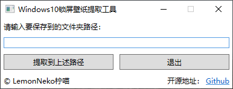

# ExtraTheLockScreenWallpaper
偶然发现今天的Windows10锁屏壁纸很好看？想提取出来？试试这个工具吧，它能帮您从Windows缓存中将壁纸提取到您指定的目录，在使用这个工具之前，您还需要安装[.Net5的运行时](https://dotnet.microsoft.com/download/dotnet/thank-you/sdk-5.0.100-rc.1-windows-x64-installer) 。更重要的是，它是免费而且开源的！

### 屏幕截图
